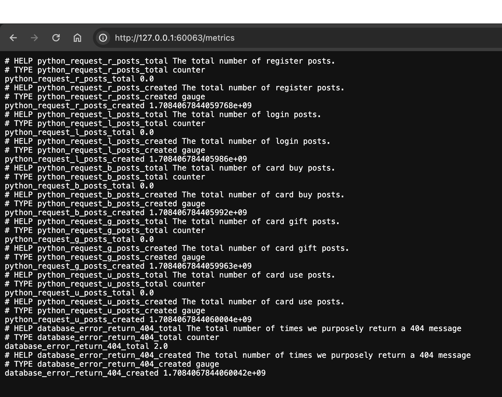
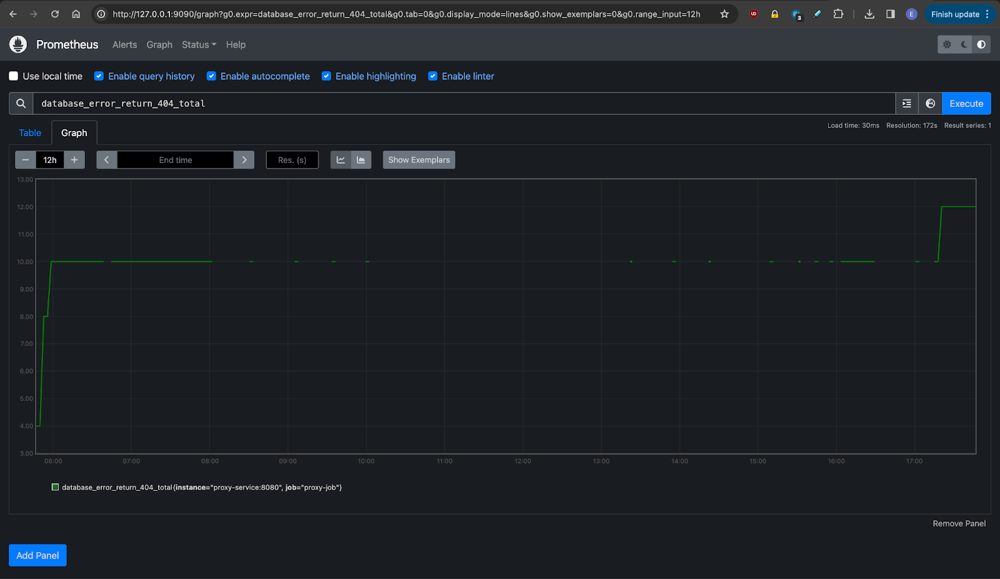

# Frequently Asked Questions

## How do I interact with my docker images?
To check what docker images you have built, run `docker image ls`, below is example output.

```
REPOSITORY                    TAG            IMAGE ID       CREATED        SIZE
nyuappsec/assign3-db          v0             18756add02dd   2 days ago     444MB
nyuappsec/assign3-proxy       v0             bab62e6f1d2d   2 days ago     47.6MB
nyuappsec/assign3             v0             51c1d0517639   2 days ago     379MB
```

What if I want to delete a Docker image? run `docker image rm <REPOSITORY>/<TAG>`. 
For example, if we want to delete `nyuappsec/assign3:v0`, run `docker image rm nyuappsec/assign3:v0`.
You would see the following output,

```commandline
Untagged: nyuappsec/assign3:v0
Deleted: sha256:51c1d05176395b10c4d2db6f7329fd9f099ef0f9ddca2865600ef5e67b03de73

# docker image ls
REPOSITORY                    TAG            IMAGE ID       CREATED        SIZE
nyuappsec/assign3-db          v0             18756add02dd   2 days ago     444MB
nyuappsec/assign3-proxy       v0             bab62e6f1d2d   2 days ago     47.6MB
```

## How do I shut everything down and restart from scratch?

You can use `kubectl delete -f` to remove the resources specified in a YAML file. So for the resources in this assignment:

```
kubectl delete -f proxy/k8
kubectl delete -f GiftcardSite/k8
kubectl delete -f db/k8
```

Note that removing pods will *not* remove their persistent storage, and even deleting the persistent volume and persistent volume claim won't do it. To actually delete the data, you'll need to use `minikube ssh` to get access to the host container, and then remove the files there.

For example, to get rid of the persistent volume associated with the database (`mysql-pv`), you would do:

```
youruser@$ minikube ssh
docker@minikube:~$ sudo rm -rf /data/mysql-pv
docker@minikube:~$ logout
```

You can find out where the data for a persistent volume is located by looking at its `hostPath` in the PersistentVolume YAML file:

```
  hostPath:
    path: /data/mysql-pv
```

## How do I see what's going wrong?

Start by looking at what pods are running, and their states:

```
kubectl get pods
```

If a pod is in a state other than `Running`, you can get more details about it:

```
kubectl describe pod <pod_name>
```

You can also ask for logs from a pod:


```
kubectl logs <pod_name>
```

Finally, it might be helpful to run a shell inside the pod's container so that you can run commands and see what's going on. You can do that by running:

```
kubectl exec --stdin --tty <pod_name> -- bash
```

Some pods (e.g., the GiftcardSite pod) don't have Bash installed, so you'll need to use `sh` instead.

## Why can't kubectl find my Docker image?

The most common reason is that you forgot to run `eval $(minikube docker-env)` before running `docker build`.
This points to the Docker client at the minikube Docker daemon.

Another common mistake is specifying the image version in the YAML file as `latest` (e.g., `my_image:latest`). This will make kubectl try to fetch the image from a remote repository, which will fail if it's an image you've created locally. You can override this behavior either by removing the `:latest` tag, or by adding `imagePullPolicy: Never` to the YAML file.

## How can I open the web interface for a service?

You can find out what services are available by doing `minikube service list`:

```
caterina:k8s moyix$ minikube service list 
|----------------------|-------------------------------|--------------|-----|
|      NAMESPACE       |             NAME              | TARGET PORT  | URL |
|----------------------|-------------------------------|--------------|-----|
| default              | assignment3-django-service    |         8000 |     |
| default              | kubernetes                    | No node port |
| default              | mysql-service                 | No node port |
| default              | prometheus-alertmanager       | No node port |
| default              | prometheus-kube-state-metrics | No node port |
| default              | prometheus-node-exporter      | No node port |
| default              | prometheus-pushgateway        | No node port |
| default              | prometheus-server             | No node port |
| default              | proxy-service                 |         8080 |     |
| kube-system          | kube-dns                      | No node port |
| kubernetes-dashboard | dashboard-metrics-scraper     | No node port |
| kubernetes-dashboard | kubernetes-dashboard          | No node port |
|----------------------|-------------------------------|--------------|-----|
```

Then pick a service and use `minikube service <name>` to open a browser to that service's URL:

```
caterina:k8s moyix$ minikube service prometheus-server
|-----------|-------------------|-------------|--------------|
| NAMESPACE |       NAME        | TARGET PORT |     URL      |
|-----------|-------------------|-------------|--------------|
| default   | prometheus-server |             | No node port |
|-----------|-------------------|-------------|--------------|
😿  service default/prometheus-server has no node port
🏃  Starting tunnel for service prometheus-server.
|-----------|-------------------|-------------|------------------------|
| NAMESPACE |       NAME        | TARGET PORT |          URL           |
|-----------|-------------------|-------------|------------------------|
| default   | prometheus-server |             | http://127.0.0.1:61867 |
|-----------|-------------------|-------------|------------------------|
🎉  Opening service default/prometheus-server in default browser...
❗  Because you are using a Docker driver on darwin, the terminal needs to be open to run it.
```

## How do I know if metrics are being scraped?
You can check the `/metrics` endpoint to verify any new targets, notice the database_error target in this image:



## How do I know if I set up the proxy job correctly in configmaps?
The proxy-job entry in the Prometheus targets page represents a monitoring job configured to scrape metrics from a service running at http://proxy-service:8080/metrics.
This image shows proxy-job is currently up, meaning Prometheus can successfully reach and retrieve metrics from it.


## How do I know if I have finished Part 2?
This image is a Prometheus graph displaying a metric named database_error_return_404_total. It represents the total count of 404 Not Found errors returned by a database over the past 12 hours. The graph's flat line for the majority of the time indicates a lack of these errors or a constant count. Notably, there's a sharp rise towards the end, signaling a sudden increase in 404 errors. This is because I manually caused the error by visiting a page that resulted in error 404, then after waiting a few moments for the scrape, I can view the increase in the graph.


Here is a gif demonstrating the various actions and activities you can use Prometheus for.


## Other things to note
* We recommend using the docker driver for minikube
(you'll see a message like "✨ Using the docker driver based on existing profile" when running minikube start).
If you find that it's using some other driver, run two commands listed below.
There's a bit more information in the [documentation](https://minikube.sigs.k8s.io/docs/drivers/docker/).

```Bash
minikube delete
minikube start --driver=docker
```
* When removing the mysql-related parts of the cluster,
you might find that kubectl hangs waiting for the persistent volume claim to be deleted.
A workaround is to run the following from another terminal window (or run it before trying to delete the mysql stuff).

```Bash
kubectl patch pvc mysql-pvc -p '{"metadata":{"finalizers":null}}'
```
